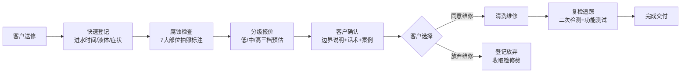

## 1. 产品概述

进水机检修报价助手是一款专为手机维修柜台和检测师设计的 Web 应用，以耐心报价顾问的口吻，帮助维修人员将不确定的进水维修问题讲清楚、说明白。通过标准化的检测流程、分级报价机制和清晰的边界说明，提升客户信任度，减少沟通纠纷，提高维修转化率。

## 2. 核心功能

### 2.1 用户角色

| 角色 | 登录方式 | 核心权限 |
|------|----------|----------|
| 维修柜台人员 | 无需登录（本地存储） | 快速登记、检查记录、生成报价、客户确认 |
| 检测工程师 | 无需登录（本地存储） | 详细检测、分级报价、复检追踪、案例参考 |

### 2.2 功能模块

1. **快速登记页**：进水基础信息录入，客户症状描述
2. **腐蚀检查页**：分部位拍照留档，腐蚀状态标注
3. **分级报价页**：智能生成低中高三档预估方案
4. **客户确认页**：边界说明、话术模板、案例参考
5. **复检追踪页**：清洗结果记录、二次检测、功能测试

### 2.3 页面详情

| 页面名称 | 模块名称 | 功能描述 |
|----------|----------|----------|
| 快速登记 | 基础信息 | 进水时间、液体类型选择、是否开机充电 |
| 快速登记 | 客户处理 | 客户已做应急处理记录 |
| 快速登记 | 当前症状 | 多选症状标签（不开机、屏幕异常、触摸失灵等） |
| 腐蚀检查 | 部位检查 | 外观、屏幕、主板、接口、电池、摄像头、扬声器检查 |
| 腐蚀检查 | 状态标注 | 每项标注：正常/轻微腐蚀/严重腐蚀/待拆检 |
| 腐蚀检查 | 拍照留档 | 支持拍照或上传图片，标注部位 |
| 分级报价 | 报价项目 | 清洗烘干、排线更换、屏幕风险、主板维修、资料抢救 |
| 分级报价 | 档位生成 | 自动计算低/中/高三档价格范围 |
| 分级报价 | 检修费 | 自动计算检测费用，支持放弃维修登记 |
| 客户确认 | 边界说明 | 先检测后报价、可能追加费用、无法保证完全恢复 |
| 客户确认 | 话术模板 | 常见问题解释话术，一键复制 |
| 客户确认 | 案例参考 | 同类进水机型维修案例展示 |
| 客户确认 | 有效期 | 报价有效期设置和显示 |
| 复检追踪 | 清洗记录 | 清洗方式、时长、结果记录 |
| 复检追踪 | 二次检测 | 电流表现、主板状态二次检测 |
| 复检追踪 | 功能测试 | 各项功能测试结果记录 |
| 复检追踪 | 客户选择 | 维修/放弃/资料导出等选择记录 |

## 3. 核心流程

客户送修进水手机 → 柜台快速登记基础信息 → 检测师分部位检查并拍照留档 → 系统生成低中高三档报价 → 用通俗语言和案例向客户解释边界和风险 → 客户确认方案 → 清洗维修后复检追踪 → 记录最终结果。

## 4. 用户界面设计

### 4.1 设计风格

- **主色调**：温暖的医疗蓝 `#2563EB`（专业、可信赖），搭配柔和的珊瑚橙 `#F97316`（关怀、温度）
- **中性色**：暖灰色系（不冰冷），背景使用米白色 `#FFFBF5`
- **按钮风格**：大圆角（16px），微立体阴影，按下有反馈
- **字体**：标题使用「Noto Serif SC」（专业稳重），正文使用「Noto Sans SC」（清晰易读）
- **布局风格**：卡片式布局，充足留白，分组清晰，引导式填写
- **图标风格**：Lucide 线性图标，柔和圆润，统一 24px 尺寸
- **整体氛围**：像一位耐心的医生问诊界面，专业但不冷漠，严谨但有温度

### 4.2 页面设计概览

| 页面名称 | 模块名称 | UI 元素 |
|----------|----------|----------|
| 快速登记 | 表单区域 | 大卡片分组，标签式选项，时间轴样式显示进水时间 |
| 腐蚀检查 | 检查网格 | 2列网格布局，每个部位卡片含状态切换按钮和拍照入口 |
| 分级报价 | 三档对比 | 并排三个价格卡片，用不同颜色边框区分档位，可展开明细 |
| 客户确认 | 说明区域 | 用通俗语言分点说明，重要内容用色块高亮，话术卡片可复制 |
| 复检追踪 | 时间线 | 纵向时间线展示清洗→检测→测试→选择全过程 |

### 4.3 响应式设计

- **设计方式**：移动优先（Mobile-First），因为主要在维修柜台使用平板或手机操作
- **断点**：360px（手机）、768px（平板）、1024px（桌面）
- **触摸优化**：按钮最小高度 48px，输入框充足内边距，避免误触
- **导航**：底部 Tab 导航（5个图标对应5个页面），当前页高亮显示
- **表单**：标签在上，输入框在下，单选使用大色块按钮而非下拉

### 4.4 动效设计

- **页面切换**：左右滑动过渡，模拟原生 App 体验
- **卡片加载**：渐入 + 轻微上浮，0.3s 缓动
- **状态切换**：平滑颜色过渡，带轻微缩放反馈
- **进度指示**：顶部步骤条，完成后有对勾动画
- **提交成功**：绿色波纹扩散动画，增强确认感
