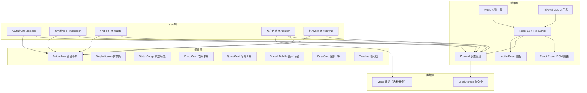
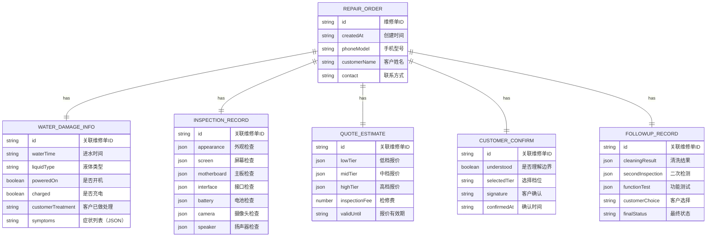

## 1. 架构设计



## 2. 技术说明

- **前端框架**：React@18 + TypeScript@5 + Vite@5
- **样式方案**：Tailwind CSS@3.4 + CSS 变量主题系统
- **路由管理**：React Router DOM@6
- **状态管理**：Zustand@4（轻量级，适合单页应用）
- **图标库**：Lucide React@0.400
- **数据持久化**：LocalStorage（无需后端，离线可用）
- **项目模板**：react-ts（纯前端，无后端依赖）
- **包管理器**：npm（Windows 环境）

## 3. 路由定义

| 路由路径 | 页面名称 | 说明 |
|----------|----------|------|
| `/` | 重定向到 /register | 默认进入登记页 |
| `/register` | 快速登记页 | 记录进水基础信息和症状 |
| `/inspection` | 腐蚀检查页 | 分部位检查和拍照留档 |
| `/quote` | 分级报价页 | 生成低中高三档报价 |
| `/confirm` | 客户确认页 | 边界说明和客户确认 |
| `/followup` | 复检追踪页 | 清洗复检和最终结果 |

## 4. 数据模型

### 4.1 数据结构定义



### 4.2 TypeScript 类型定义

```typescript
// 检修单基础信息
interface RepairOrder {
  id: string;
  createdAt: string;
  phoneModel: string;
  customerName: string;
  contact: string;
  status: 'registered' | 'inspecting' | 'quoted' | 'confirmed' | 'followup' | 'completed' | 'abandoned';
}

// 进水信息
interface WaterDamageInfo {
  waterTime: string;           // 进水时间：1小时内/1-6小时/6-24小时/超过24小时
  liquidType: string;          // 液体类型：清水/茶水/咖啡/可乐/海水/其他
  poweredOn: boolean;          // 进水后是否开机
  charged: boolean;            // 进水后是否充电
  customerTreatment: string[]; // 客户已做处理：擦干/甩水/吹风机/大米/其他
  symptoms: string[];          // 当前症状：不开机/屏幕异常/触摸失灵/无声音/不充电/其他
}

// 检查项状态
type InspectionStatus = 'normal' | 'mild' | 'severe' | 'pending';

interface InspectionItem {
  status: InspectionStatus;
  photos: string[];           // 图片base64或路径
  remark: string;             // 备注
}

interface InspectionRecord {
  appearance: InspectionItem;    // 外观
  screen: InspectionItem;        // 屏幕
  motherboard: InspectionItem;   // 主板
  interface: InspectionItem;     // 接口
  battery: InspectionItem;       // 电池
  camera: InspectionItem;        // 摄像头
  speaker: InspectionItem;       // 扬声器
}

// 报价项目
interface QuoteItem {
  name: string;
  description: string;
  price: number;
  included: boolean;
}

interface QuoteTier {
  name: string;              // 经济档/标准档/全面档
  description: string;
  items: QuoteItem[];
  totalMin: number;
  totalMax: number;
}

interface QuoteEstimate {
  lowTier: QuoteTier;
  midTier: QuoteTier;
  highTier: QuoteTier;
  inspectionFee: number;     // 检修费
  validDays: number;         // 报价有效期天数
  validUntil: string;        // 有效期截止日期
}

// 话术模板
interface SpeechTemplate {
  id: string;
  category: string;          // 价格解释/风险说明/时间预估
  title: string;
  content: string;
}

// 同类案例
interface SimilarCase {
  id: string;
  phoneModel: string;
  waterDamage: string;
  solution: string;
  result: string;
  cost: number;
}
```

## 5. 目录结构

```
src/
├── components/           # 公共组件
│   ├── BottomNav.tsx    # 底部导航
│   ├── StepIndicator.tsx # 步骤条
│   ├── StatusBadge.tsx  # 状态标签
│   ├── PhotoCard.tsx    # 拍照卡片
│   ├── QuoteCard.tsx    # 报价卡片
│   ├── SpeechBubble.tsx # 话术气泡
│   ├── CaseCard.tsx     # 案例卡片
│   └── Timeline.tsx     # 时间线
├── pages/               # 页面组件
│   ├── RegisterPage.tsx # 快速登记
│   ├── InspectionPage.tsx # 腐蚀检查
│   ├── QuotePage.tsx    # 分级报价
│   ├── ConfirmPage.tsx  # 客户确认
│   └── FollowupPage.tsx # 复检追踪
├── store/               # 状态管理
│   └── useRepairStore.ts # 维修单状态
├── data/                # 静态数据
│   ├── speechTemplates.ts # 话术模板
│   └── similarCases.ts  # 案例数据
├── utils/               # 工具函数
│   ├── quoteCalculator.ts # 报价计算
│   ├── idGenerator.ts   # ID生成
│   └── storage.ts       # 本地存储
├── types/               # 类型定义
│   └── index.ts         # 全局类型
├── App.tsx              # 应用入口
├── main.tsx             # React 入口
└── index.css            # 全局样式
```
